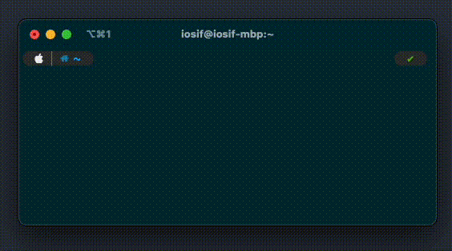

# 📟 cli-path

[](https://www.npmjs.com/package/cli-path)
[](https://github.com/iosifv/cli-path/actions/workflows/cli-app-test-build.yaml)

A simple CLI tool to search paths on google maps. The intent is to use this on your most often taken paths to quickly get the grasp of the time needed for your travel - like going home from the office every day.

## Online links for this project

- [website](https://iosifv.github.io/cli-path/) - Github Pages
- [github](https://github.com/iosifv/cli-path) - Github repository
- [npm](https://www.npmjs.com/package/cli-path) - NPM Package for the cli app
- [OpenAPI schema, live](https://cli-path.vercel.app/docs) - Swagger UI, same-origin with the API so "Try it out" actually works (this exact page is [also here](https://iosifv.github.io/cli-path/swagger/) on GitHub Pages, but the API has no CORS headers, so "Try it out" fails cross-origin from there — reading the spec still works fine)
- todo: api dashboard

## Installation

```
npm install -g cli-path
```

or

```
yarn add -g cli-path
```

These will add the global executable `clip`

## Usage

### Authentication

To use our built in api, select the "Authentication" option from the interactive menu.


### Searching raw text

Then you can search for a direction informaiton using free text


### Save new locations


### Searching from saved locations


### Config

Update application config parameters


## Programming Concepts / Technologies used

The real reason I built this is for training purposes. Since every tutorial out there is trying to teach you how to increase one certain skill vertically, with this project I'm trying to expand vertically by touching as many technologies possible for this humble subject of making a Google Maps API call 🙂

### Architecture

The very zoomed out explanation is: a cli-app will call a maps API to view directions information within the terminal. In order to not have the user generate and add his own map provider tokens, a second API is built which stands in between the cli-app and the map provider. This way the user can choose to use our instantly available Clip API, or query a provider directly with his own credentials.

The CLI picks between the two through an [Adapter](https://refactoring.guru/design-patterns/adapter) (`PathController`), so swapping what sits behind the hosted API doesn't change the client.

> **Note — the API tier was rebuilt.** The original implementation was AWS Lambda via the Serverless Framework; it is now frozen in [`archived-sls-api/`](https://github.com/iosifv/cli-path/tree/main/archived-sls-api) and no longer deployed. Its replacement, `vercel-api/`, is live on Vercel Functions at `https://cli-path.vercel.app/api/`, backed by [OpenRouteService](https://openrouteservice.org/) instead of Google Maps — chosen because it hard-fails with `429` past its free tier rather than billing, which the Google-backed archived API could not guarantee. The CLI's default `clip` engine points at it.

### List of implemented things

- CLI App written in Javascript
  - [Commander](https://www.npmjs.com/package/commander) as a general framework to build the cli app and commands
  - [Configstore](https://www.npmjs.com/package/configstore) to save secret dotfile style settings
  - [Chalk](https://www.npmjs.com/package/chalk), [Ora](https://www.npmjs.com/package/ora), [Inquirer](https://www.npmjs.com/package/inquirer) and [cli-table3](https://www.npmjs.com/package/cli-table3) for a nicer interface
  - [Adapter Design Pattern](https://refactoring.guru/design-patterns/adapter) used for managing multiple search engines
  - [Chai](https://www.chaijs.com/) + [Mocha](https://mochajs.org/) + [Istanbul](https://istanbul.js.org/) for testing and code coverage
- 🗄️ _(archived, frozen, no longer deployed)_ API implemented with [Serverless Framework](https://www.serverless.com/) written in Typescript — see [`archived-sls-api/ARCHIVED.md`](https://github.com/iosifv/cli-path/tree/main/archived-sls-api)
  - [Serverless Offline](https://www.serverless.com/plugins/serverless-offline) used for easy implementation
  - [Serverless Dotenv](https://www.serverless.com/plugins/serverless-dotenv-plugin) used to save secrets in a familiar way
  - [middy](https://middy.js.org/) used for handling authentication within the middleware layer
  - [DynamoDB](https://aws.amazon.com/dynamodb/) used to count API calls and cap them globally — replaced by an atomic Redis counter in the live API, since a full-table `Scan` on every request doesn't scale
- API live on [Vercel](https://vercel.com/) Functions, written in Typescript — see `vercel-api/`
  - Backed by [OpenRouteService](https://openrouteservice.org/) for geocoding and routing, reached through [Upstash Redis](https://upstash.com/) (via the Vercel Marketplace) for an atomic monthly call counter
  - [Ajv](https://ajv.js.org/) validates each request body against a JSON Schema before it reaches a provider
  - [Vitest](https://vitest.dev/) for testing (the client tier uses Mocha instead — see below)
- Authentification provided by [Auth0](https://auth0.com/)
  - Implemented [Device Authorization Flow](https://auth0.com/docs/get-started/authentication-and-authorization-flow/call-your-api-using-the-device-authorization-flow) - This way, the user just needs to open a link from a browser rather than cumbersome authentication in the CLI
  - Implemented [OAuth](https://auth0.com/docs/authenticate/protocols/oauth) with Google, Github, Linkedin and Facebook as providers
- [Insomnia](https://insomnia.rest/) and [Postman](https://www.postman.com/) for api testing - synced repository, so you only need to point to this repo and you get all the endpoints
- [Github Actions](https://github.com/features/actions)
  - A static page is created and deployed for this page you're reading through [Github Pages](https://pages.github.com/) & Actions
- [VHS](https://github.com/charmbracelet/vhs) for demo-ing the CLI app.
  - Could be used for integration testing (if the gif looks ok in the final product then all is good)
- [OpenAPI](https://www.openapis.org/) specification, rendered with Swagger UI at `docs/swagger/`
  - `vercel-api/vercel.json` rewrites `/docs/*` on the live API to this same page, so it's reachable same-origin at `cli-path.vercel.app/docs` without a second copy
  - Swagger UI's "Authorize" button can fetch a token itself via Auth0 (Authorization Code + PKCE, same public `client_id` as the CLI's device flow) instead of pasting one in manually — see `postman/schemas/index.yaml`'s `auth0` security scheme and `docs/swagger/dist/swagger-initializer.js`'s `initOAuth()` call
  - The API sends no CORS headers (never needed them — the CLI is a Node client, not a browser), so "Try it out" only works from the `cli-path.vercel.app/docs` copy, which is same-origin with `/api/*`. The GitHub Pages copy is a different origin and gets a CORS error on any actual call; it's still fine for browsing the spec and even for getting a token, just not for calling the live endpoints
- OpenSpec capability specs under `openspec/specs/` — `cli-command-dispatch`, `cli-device-authentication`, `cli-engine-adapter` and `cli-persistent-config` describe the client tier; `directions-api` and `usage-quota` describe the API once `add-vercel-ors-api` archives

### List of todo's

- Publish a patched `cli-app` to npm now that the live API is pointed at correctly
- Re-record the VHS demo gifs against the live API
- Create system for versioning

### Problems encountered that are worth mentioning

Just to be clear, these are worth mentioning to my future self so that I don't do these mistakes again

- reading package.json with the purpose of showing the app's version
  - The actual issue is finding the package.json file when executing the binary from various folders in the user's machine
- Deploying the authentication sls function which works fine locally
  - Invalid model specified: Validation Result: warnings : [], errors : [Invalid model schema specified]
  - The problem for this was leaving within the schema definition `required: [],` instead of deleting the required field completely
- Forgot to add scope(s) to the request token call
  - This way, later in the execution, when calling auth0_api/userinfo an empty object is returned

### Links that helped me build this

- [Youtube - I created a Command Line Game for you // 5-Minute Node.js CLI Project](https://www.youtube.com/watch?v=_oHByo8tiEY)
- [Youtube - Easy Way to Create CLI Scripts with JavaScript and Node](https://www.youtube.com/watch?v=dfTpFFZwazI)
- [Youtube - Node.js CLI For Cryptocurrency Prices](https://www.youtube.com/watch?v=-6OAHsde15E)
- [Example CLI App - Coindex](https://github.com/bradtraversy/coindex-cli)
- [Auth0 - Device Authorization Flow](https://auth0.com/docs/get-started/authentication-and-authorization-flow/call-your-api-using-the-device-authorization-flow#call-api)
- [Auth0 - Validate Access Tokens](https://auth0.com/docs/secure/tokens/access-tokens/validate-access-tokens)
